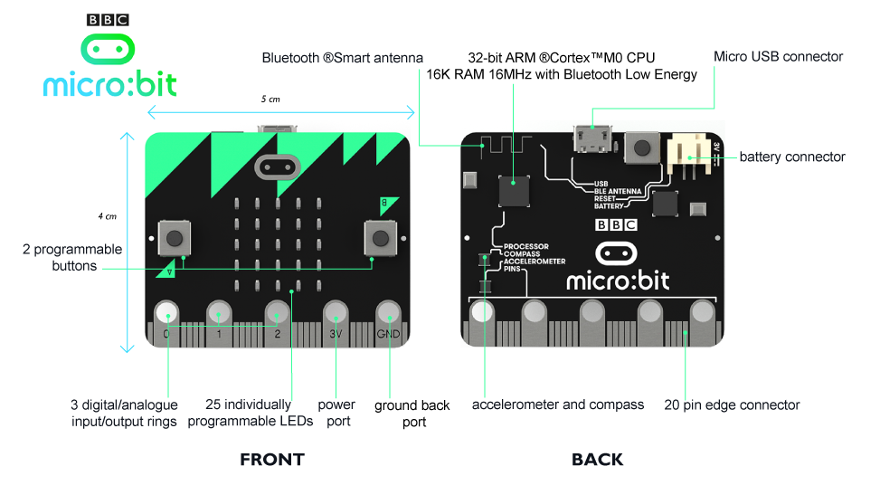

# MicroBit

* Official web: https://microbit.co.uk
* Price: ~13£ (UK), 20€ (ES)


## Hardware


https://www.microbit.co.uk/device
* See: http://tech.microbit.org/hardware/
* Size: 5cm x 4cm
* Sensors:
  * 2 buttons
  * Accelerometer
  * Compass
* Actuators:
  * 5x5 red LED matrix


## Pinout

* Inputs:
  * 6 Analog
  *
* Outputs:


Shields, craddles, and compatible hardware:  https://www.kitronik.co.uk/microbit/bbc-micro-bit-accessories.html

## Communications
USB to PC
Serial
Inalambric 2,4Ghz
Bluetooth

## Coding

### Online
* Blocks/JavaScript: https://makecode.microbit.org/
* Python: http://python.microbit.org/v/1

Operative: download a .hex file and upload it to the board.

### Offline
Micropython doc: http://microbit-micropython.readthedocs.io/en/latest/

Uflash: https://uflash.readthedocs.io/en/latest/

Mu editor https://codewith.mu/


## Operative

### Send a program
```bash
uflash <python_file.py>
```

### Online shell
Open a terminal to the board.
```bash
# OPTION 1: minicom
minicom --device=/dev/ttyACM0 --baudrate=115200

# OPTION 2: screen
screen /dev/ttyACM0 115200
```


# Links
* Radio: https://lancaster-university.github.io/microbit-docs/ubit/radio/


# Custom modules
* mu editor.
* [MicroFS](http://microbit-micropython.readthedocs.io/en/latest/tutorials/storage.html) (command line)


## interesante
* Tema raspi https://www.raspberrypi.org/forums/viewtopic.php?t=127930
* yaw, pitch roll https://subefotos.com/ver/?e13c0169b67945012741535275cd4657o.png
* Kalman filter
  * https://en.wikipedia.org/wiki/Kalman_filter
  * https://es.mathworks.com/videos/series/understanding-kalman-filters.html
  * https://www.mathworks.com/videos/understanding-kalman-filters-part-1-why-use-kalman-filters--1485813028675.html
  * http://biorobotics.ri.cmu.edu/papers/sbp_papers/integrated3/kleeman_kalman_basics.pdf
  * Issue en github https://github.com/bbcmicrobit/micropython/issues/95
  * Implementación: http://scipy-cookbook.readthedocs.io/items/KalmanFiltering.html
* Charla PyCon UK 2016 https://www.youtube.com/watch?v=MP1HWaylg-Q
* Lib python http://work.thaslwanter.at/skinematics/html/


* pitch roll yaw https://www.dfrobot.com/wiki/index.php/How_to_Use_a_Three-Axis_Accelerometer_for_Tilt_Sensing


visualización
mayavi2, parece viejo
panda3d solo python2

vtk - OK
AL lanzar
Error:
ImportError: No module named 'vtkOpenGLKitPython'
Solucion:
export LD_LIBRARY_PATH=venv3.5/lib/python3.5/site-packages/vtk:$LD_LIBRARY_PATH


vispy http://vispy.org - OK

Gimball lock
https://www.youtube.com/watch?v=oj7v3MXJL3M
